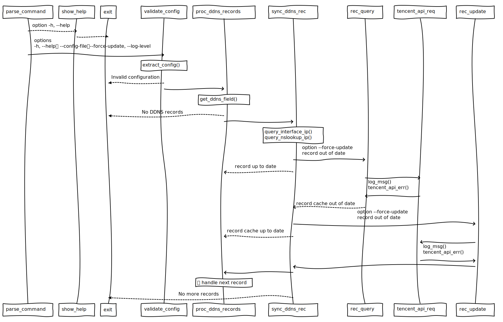

<div align="center">
  <h1>A DDNS Shell Script: ddnspod.sh</h1>
</div>

<p align="center">
  <a href="https://github.com/qingzi-zhang/dnspod-shell/blob/main/LICENSE">
    
  </a>
</p>

🔁 **Synchronize DDNS via DNSPod API 3.0**



## Installation
Clone & installation:
```
git clone https://github.com/qingzi-zhang/dnspod-shell
sudo cp dnspod-shell/ddnspod /etc/config/ddnspod
sudo ln -s dnspod-shell/ddnspod.sh /usr/local/ddnspod.sh
sudo chmod 600 /usr/local/ddnspod.sh
```

## Configuration
Replace the DDNS configuration in the file: `/etc/config/ddnspod`
- SecretId=`AKIDz8krbsJ5yKBZQpn74WFkmLPx3*******`
- SecretKey=`Gu5t9xGARNpq86cd98joQYCN3*******`
- DDNS=`domain,subdomain,type,interface`
- DDNS=`domain.ai,www,IPv6,pppoe-wan`

## Usage
```
Usage:
  ddnspod.sh [options]

Options:
  -h, --help           Show help.
  --config=<file>      Specify the config file
  --force-update       Proceed update regardless of IP status
  --log-level=<0|1>    Log level 0 (info), 1 (notice)
```
